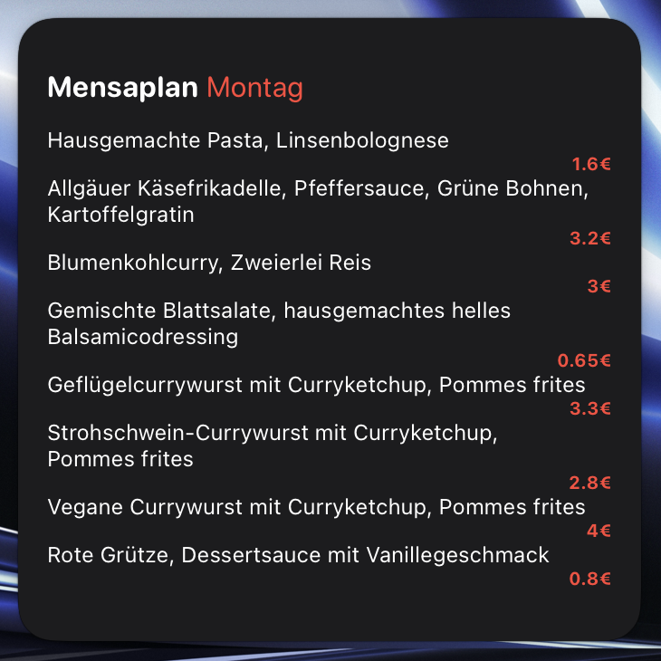

# Mensaplan Widget #

A scriptable widget (for iOS and iPadOS) that retrieves and displays your university's cafeteria menu via the OpenMensa API.
The script was developed specifically for the cafeteria menu of the "Studentenwerk Hannover", but can also be used for other universities (read below).

   
    
    
    
    
    

## Setup ##
1. Download the [Scriptable App](https://apps.apple.com/de/app/scriptable/id1405459188)
2. Download the mensaplan.js-script and open it with Scriptable
3. Configure (read below)
4. Add a new medium or large widget to your home screen (depends on the amount of meals)
5. Short press on the newly added widget and choose mensaplan as script.

## Configuration ##
### vegetarian / vegan  
If you're only interested in the vegetarian or vegan options you can let the widget only show these by replacing "false" with "true" next to the respective variables at the beginning of the script.

It is also possible to hide the salad selection, as it is often the same every day. (This only works for "Studentenwerk Hannover" or if you configure the salad_category variable correctly.)

### other city 
If you want to use the widget for another cafeteria, you'll have to replace the "mensaID" integer at the beginning of the script.

You can find out your cafeteria's ID by following these steps:
1. Sign in at the [OpenMensa website](https://openmensa.org/)
2. Look for your cafeteria on the map
3. Check if your cafeteria's menu is available
4. If so, copy the ID from the URL (https://openmensa.org/c/{mensaID}/{date})

As said in the introduction, this script is optimized for only one certain cafeteria and may not work as intended for others.
 ## Credits
 The whole widget is based on the data provided by [OpenMensa](https://openmensa.org/)
